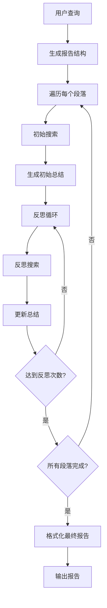

# 🧠 Deep Search Agent — 轻量级深度研究 AI 代理

[](https://python.org)  
[](LICENSE)  
[](https://github.com/666ghj/DeepSearchAgent-Demo)  
[](https://tavily.com/)  
[](https://github.com/666ghj/DeepSearchAgent-Demo)

> ✨ **极简 · 无框架 · 支持智谱 GLM-4V-Flash（完全免费）· 多轮反思 · 高质量报告**

一个**超轻量、零重型依赖**的深度搜索 AI 代理，无需 LangChain、LlamaIndex 等复杂框架，原生支持 **GLM-4V-Flash（智谱AI免费模型）**、DeepSeek、OpenAI 等主流大模型，通过多轮搜索 + 反思机制生成专业级研究报告。

---

## 🔥 为什么选择 Deep Search Agent？

| 特性 | 说明 |
|------|------|
| ✅ **极致轻量** | 仅依赖 `requests`、`tavily-python`、`streamlit` 等基础库，无 LangChain 膨胀依赖 |
| ✅ **免费模型优先** | 支持 **智谱 GLM-4V-Flash（免费且强大）**，大幅降低使用成本 |
| ✅ **即插即用 LLM** | 通过统一接口轻松切换 DeepSeek / OpenAI / GLM / 自定义模型 |
| ✅ **智能多轮反思** | 自动识别信息缺口，迭代搜索补充，避免浅层回答 |
| ✅ **完整状态管理** | 支持中断恢复、进度追踪、中间结果保存 |
| ✅ **美观 Markdown 输出** | 自动生成带标题、引用、结构清晰的研究报告 |

---

## 🌐 支持的模型（含免费选项）

| 模型 | 提供方 | 是否免费 | 配置示例 |
|------|--------|--------|--------|
| **`glm-4v-flash`** | 智谱 AI (Zhipu) | ✅ **免费**（需注册） | `default_llm_provider="zhipu"` |
| `deepseek-chat` | DeepSeek | ✅ 免费额度 | `default_llm_provider="deepseek"` |
| `gpt-4o-mini` | OpenAI | ❌ 付费 | `default_llm_provider="openai"` |
| 自定义模型 | 任意 OpenAI 兼容 API | ✅ | 实现 `BaseLLM` 接口即可 |

> 💡 **推荐新手使用 `glm-4v-flash`**：性能接近 GPT-4，响应快，**完全免费**！

---

## ⚙️ 工作原理



### 核心流程

1. **结构生成**: 根据查询生成报告大纲和段落结构
2. **初始研究**: 为每个段落生成搜索查询并获取相关信息
3. **初始总结**: 基于搜索结果生成段落初稿
4. **反思优化**: 多轮反思，发现遗漏并补充搜索
5. **最终整合**: 将所有段落整合为完整的Markdown报告


## 🚀 快速开始（5 分钟上手）

### 1. 安装依赖（极简！）

```bash
git clone https://github.com/666ghj/DeepSearchAgent-Demo.git
cd DeepSearchAgent-Demo

# 强烈建议使用虚拟环境
python -m venv venv && source venv/bin/activate  # Linux/Mac
# 或 python -m venv venv && venv\Scripts\activate  # Windows

pip install -r requirements.txt
```

> 📦 `requirements.txt` 仅包含：
> ```
> requests>=2.28.0
> tavily-python>=0.3.0
> streamlit>=1.30.0
> zhipuai>=2.0.0   # 用于 GLM
> openai>=1.0.0    # 可选
> ```

### 2. 配置 API 密钥（支持免费模型！）

编辑 `config.py`：

```python
# === 免费推荐：智谱 GLM-4V-Flash ===
ZHIPU_API_KEY = "your_zhipu_api_key"  # 免费注册：https://bigmodel.cn/

# === 其他可选 ===
DEEPSEEK_API_KEY = "..."   # https://platform.deepseek.com/
OPENAI_API_KEY = "..."     # https://platform.openai.com/

# === 核心配置 ===
DEFAULT_LLM_PROVIDER = "zhipu"      # ← 改这里启用免费模型！
ZHIPU_MODEL = "glm-4v-flash"        # 免费、快、强！

MAX_REFLECTIONS = 2                 # 反思轮数（越高越深入）
SEARCH_RESULTS_PER_QUERY = 3
OUTPUT_DIR = "reports"
```

> 🔑 获取免费密钥：
> - **智谱 GLM**：[https://bigmodel.cn](https://bigmodel.cn) → 开发者平台 → API Key
> - **Tavily 搜索**：[https://tavily.com](https://tavily.com) → 免费 1000 次/月

### 3. 运行示例

#### 方式一：命令行（最快）

```bash
python examples/basic_usage.py
```

#### 方式二：Web 界面（交互友好）

```bash
streamlit run examples/streamlit_app.py
```
→ 在浏览器中输入问题，实时查看研究过程！

#### 方式三：编程调用

```python
from src import DeepSearchAgent, load_config

config = load_config()
agent = DeepSearchAgent(config)

report = agent.research("2025年AI芯片发展趋势", save_report=True)
print(report)
```

---

## 🧩 项目结构（清晰简洁）

```
src/
├── llms/               # LLM 接入层（新增模型只需加一个文件！）
│   ├── base.py         # 抽象基类
│   ├── glm.py          # ✅ GLM-4V-Flash 支持
│   ├── deepseek.py
│   └── openai_llm.py
├── nodes/              # 研究流程节点（结构生成、搜索、总结等）
├── tools/search.py     # Tavily 搜索封装
├── utils/config.py     # 配置加载
└── agent.py            # 主代理逻辑
```

---

## 💖 关于作者

如果你觉得它对你有帮助：

- ✅ **点个 Star** 是最大的鼓励！
- 💬 欢迎提 Issue 或 PR，一起让它变得更好

📧 联系邮箱：[shaoycamore@gmail.com](mailto:shaoycamore@gmail.com)  
（可用于合作或反馈建议）


---

## 🙌 致谢

- 感谢 [智谱 AI](https://www.zhipuai.cn/) 提供 **免费强大的 GLM-4V-Flash**
- 感谢 [Tavily](https://tavily.com/) 提供高质量搜索 API
- 感谢所有 Star 和使用者的信任 ❤️

---

> 🌟 **如果你喜欢这个项目，请点个 Star！**  
> 它鼓励我继续打造 **真正轻量、实用、免费友好的 AI 工具**。

---

**MIT License** © 2025 DeepSearchAgent Team